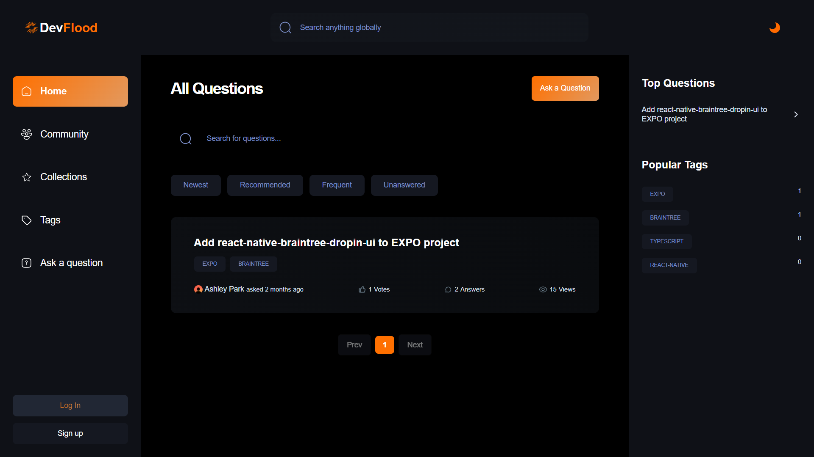
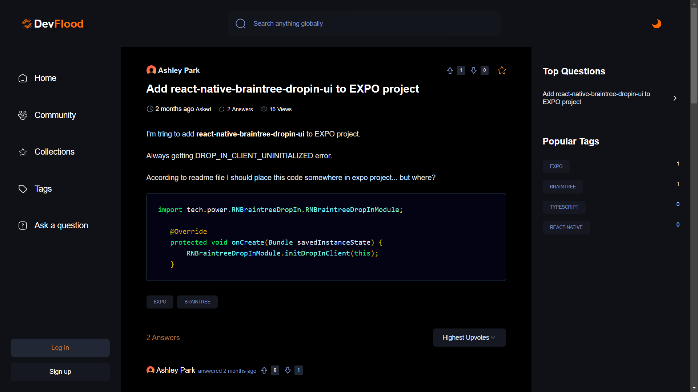

## Table of Contents

- [Table of Contents](#table-of-contents)
- [Preview](#preview)
- [Overview](#overview)
- [Installation](#installation)
- [Technologies Used](#technologies-used)

## Preview 

 

 

## Overview

- This project involves developing a web application using NextJS v14.
- The Project is a Stackoverflow clone w/ MDX (Markdown JSX) Support.
- Implemented Local as well as Global Searching functionality.
- Includes Custom Recommandation System along w/ different Category sorting.
- Facilitating power of Clerk authentication system with Webhook support for mongodb.
- [Visit devFlood](https://dev-flood.vercel.app/)

## Installation

1. Clone the repository
   `git clone https://github.com/m4dd0c/devFlood.git`
2. Install modules
   `npm i`
3. Start server
   `npm run dev`

## Technologies Used

- [NextJS 14](#Nextjs14)
- [Server Actions](#Serveractions)
- [Mongoose](#Mongoose)
- [Clerk](#clerk)
- [Webhooks](#webhooks)
- [TinyMCE](#tinymce)
- [MDX](#mdx)
- [Query String](#query-string)
